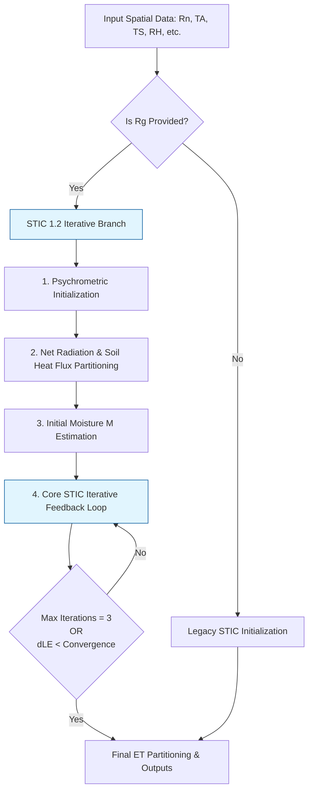
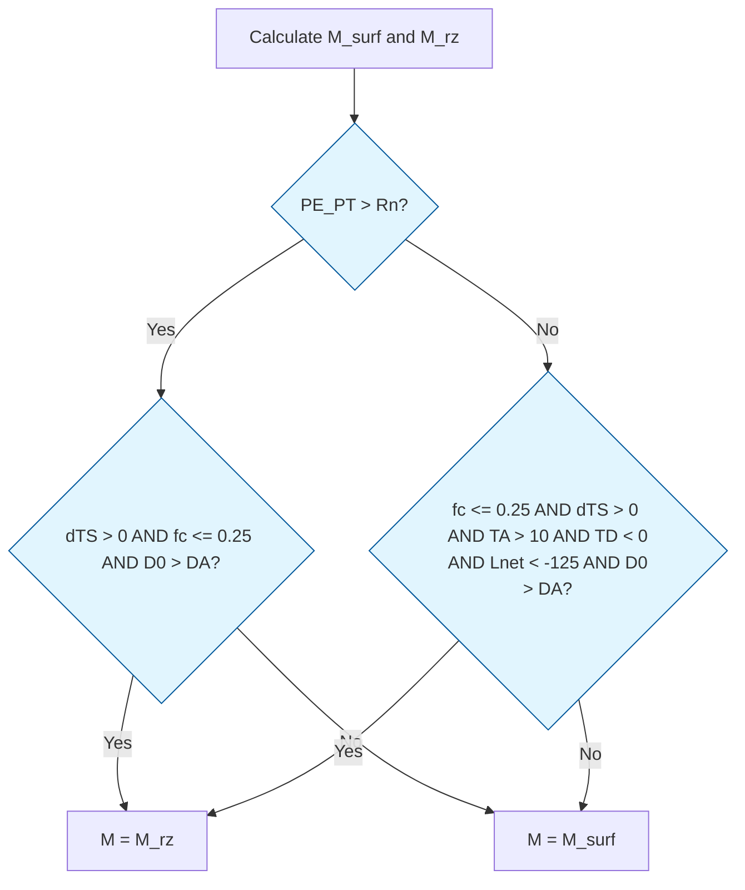

# STIC (Surface Temperature Initiated Closure) Algorithm Specification
**ECOSTRESS Collection 2 Implementation (v1.2 / v1.3 Hybrid)**

## 1. Introduction
This document outlines the exact scientific and algorithmic specifications for the Surface Temperature Initiated Closure (STIC) model as implemented in the ECOSTRESS Collection 2 Level-3/4 JPL Evapotranspiration (JET) pipeline. This implementation represents the transition from the foundational STIC 1.0/1.1 (Mallick et al., 2014) to the dynamically constrained, iterative STIC 1.2 (Mallick et al., 2015), culminating in robust limits for arid ecosystems (Mallick et al., 2018).

This specification provides all equations, constraints, and decision pathways required to port the algorithm into any target programming language (e.g., C++, Fortran, Julia).

---

## 2. Global Constants & Variable Definitions

**Constants:**
* $\sigma = 5.67 \times 10^{-8}$ W m⁻² K⁻⁴ (Stefan-Boltzmann constant)
* $\rho = 1.2$ kg m⁻³ (Air density)
* $c_p = 1013$ J kg⁻¹ K⁻¹ (Specific heat of air at constant pressure)
* $\gamma = 0.67$ hPa K⁻¹ (Psychrometric constant)
* $\alpha_{PT} = 1.26$ (Priestley-Taylor coefficient - *Used for initialization*)

**Primary Inputs:**
* $R_n$: Net Radiation (W m⁻²)
* $T_A$: Air Temperature (°C)
* $T_S$: Radiometric Land Surface Temperature (°C)
* $RH$: Relative Humidity (Fraction 0-1)
* $\epsilon$: Surface Emissivity
* $\alpha$: Surface Albedo
* $NDVI$: Normalized Difference Vegetation Index
* $R_g$: Incoming Shortwave Radiation (W m⁻²). *Note: The presence of $R_g$ dictates the "New STIC" branching pathway in Collection 2.*

---

## 3. High-Level Algorithm Architecture & Pathway Decision
In ECOSTRESS Collection 2, the pipeline branches based on the availability of $R_g$ (Incoming Shortwave Radiation). The JET pipeline passes `SWin` as $R_g$, dropping the algorithm into the physically rigorous STIC 1.2/1.3 loop.

*Pathway defined by the transition from STIC 1.0 (Mallick 2014) to STIC 1.2 iterative framework (Mallick 2015).*

---

## 4. Initialization & Psychrometrics

Prior to the closure equations, basic thermodynamic states must be established.

### 4.1 Vapor Pressures and Slope
Saturated vapor pressure at air temperature ($e_{s,A}$), actual vapor pressure ($e_a$), and the slope of the saturation curve ($\Delta$) are computed using standard approximations:

$$e_{s,A} = 6.13753 \times \exp\left(\frac{17.27 \times T_A}{T_A + 237.3}\right)$$
$$e_a = e_{s,A} \times RH$$
$$D_A = e_{s,A} - e_a \quad \text{(Vapor Pressure Deficit)}$$
$$\Delta = \frac{4098 \times e_{s,A}}{(T_A + 237.3)^2}$$

At the surface, utilizing Land Surface Temperature ($T_S$):
$$e_s^* = 6.13753 \times \exp\left(\frac{17.27 \times T_S}{T_S + 237.3}\right)$$
$$dT_S = T_S - T_A$$

### 4.2 Dewpoint Temperatures
Dewpoint temperature ($T_D$) and the radiometric surface dewpoint temperature ($T_{SD}$):
$$T_D = T_A - \left(\frac{100 - (RH \times 100)}{5.0}\right)$$

To find $T_{SD}$, the slopes of the saturation vapor pressure at $T_D$ ($s_1$) and $T_S$ ($s_3$) are approximated using 3rd-order polynomials:
$$s_1 = \left(45.03 + 3.014 T_D + 0.05345 T_D^2 + 0.00224 T_D^3\right) \times 10^{-2}$$
$$s_3 = \left(45.03 + 3.014 T_S + 0.05345 T_S^2 + 0.00224 T_S^3\right) \times 10^{-2}$$

$$T_{SD} = \frac{(e_s^* - e_a) - (s_3 T_S) + (s_1 T_D)}{s_1 - s_3}$$

*(Feature introduced in Mallick et al., 2014 to physically link $T_S$ and vapor constraints).*

---

## 5. Soil Moisture ($M$) and Energy Partitioning

### 5.1 Net Radiation & Soil Heat Flux ($G$)
Net longwave ($L_{net}$) and soil heat flux ($G$) are computed physically when $R_g$ is available. 
$$\epsilon_a = 1.24 \left(\frac{e_a}{T_A + 273.15}\right)^{1/7}$$
$$L_{net} = \epsilon \left[ \sigma \epsilon_a (T_A + 273.15)^4 \right] - \left[ \sigma \epsilon (T_S + 273.15)^4 \right]$$

To calculate $G$, the algorithm uses the Santanello & Friedl (2003) diurnal approach, modulated by fractional vegetation cover ($f_c$):
$$f_c = \text{clip}\left(\frac{NDVI - 0.04}{0.52 - 0.04}, 0, 1\right)$$
$$G = R_n \cdot c_g \cdot \cos\left(2\pi \frac{t_{g0} + 10800}{t_g}\right)$$
Where $c_g$ and $t_g$ are linearly interpolated between minimum/maximum constants based on soil moisture availability ($M$). The net available energy ($\Phi$) is:
$$\Phi = R_n - G$$

### 5.2 Soil Moisture Initialization ($M_{surf}$ and $M_{rz}$)
Surface wetness ($M_{surf}$) and root-zone moisture ($M_{rz}$) are bounded between 0.0001 and 1.0.

$$M_{surf} = \left(\frac{s_1}{s_3}\right) \left[ \frac{T_{SD} - T_D}{k_{TSTD}(T_S - T_D)} \right]$$
Where $k_{TSTD} = \frac{T_0 - T_D}{T_S - T_D}$ ($T_0$ is aerodynamic temperature). 

Root-zone moisture is derived from the advection-aridity interactions:
$$M_{rz} = \frac{\gamma s_1 (T_{SD} - T_D)}{\Delta s_3 k_{TSTD}(T_S - T_D) + \gamma s_4(T_A - T_D) - \Delta s_1 (T_{SD} - T_D)}$$
Where $s_4 = \frac{e_{s,A} - e_a}{T_A - T_D}$.

**Moisture Hysteresis Decision Logic (Mallick et al., 2015 / 2018):**
The combined moisture $M$ accounts for hysteresis depending on radiative dominance (Potential Evaporation, $PE_{PT}$, vs $R_n$).

*Decision tree logic introduced in Mallick et al., 2015 to handle disparate responses of soil vs. canopy evaporative controls.*

---

## 6. The Analytical STIC Closure Equations

STIC simultaneously solves the state equations of the Penman-Monteith surface energy balance to derive aerodynamic conductance ($g_B$), stomatal conductance ($g_S$), and the aerodynamic temperature gradient ($dT$).

**Aerodynamic Conductance ($g_B$):**
$$g_B = \frac{2 \Phi \alpha \Delta \gamma}{2 c_p \Delta e_s \rho - 2 c_p \Delta e_a \rho - 2 c_p e_a \gamma \rho + c_p e_s \gamma \rho + c_p e_s^* \gamma \rho - c_p M e_s \gamma \rho + c_p M e_s^* \gamma \rho}$$
*Constraints:* Bound between 0.0001 and 0.2 m s⁻¹.

**Surface/Stomatal Conductance ($g_S$):**
$$g_S = \frac{-2 (\Phi \alpha \Delta e_a \gamma - \Phi \alpha \Delta e_s \gamma)}{c_p (e_s^*)^2 \gamma \rho - c_p e_s^2 \gamma \rho - 2 c_p \Delta e_s^2 \rho + 2 c_p \Delta e_a e_s \rho - 2 c_p \Delta e_a e_s^* \rho + \dots - 2 c_p M e_s e_s^* \gamma \rho}$$
*(Note: Refer directly to the codebase for the full expanded algebraic polynomial for $g_S$ denominator. Concept introduced in Mallick 2014).*
*Constraints:* Bound between 0.0001 and 0.2 m s⁻¹.

**Aerodynamic Temperature Difference ($dT$):**
$$dT = \frac{2\Delta e_s - 2\Delta e_a - 2e_a\gamma + e_s\gamma + e_s^*\gamma - M e_s\gamma + M e_s^*\gamma + 2\alpha\Delta e_a - 2\alpha\Delta e_s}{2\alpha\Delta\gamma}$$
*Constraints:* Bounded between -10 and 50 °C. The aerodynamic temperature $T_0 = T_A + dT$.

---

## 7. The Core Iterative Loop ($LE$ Convergence)

Unlike STIC 1.0 which ran a single pass, STIC 1.2+ uses an iterative feedback loop where $LE$ dynamically updates the canopy-air vapor pressures and Priestley-Taylor $\alpha$ coefficient. The loop executes until the max change in $LE$ (`LE_change`) is $< 1.0$ W m⁻² or `max_iterations = 3` is reached.

### 7.1 Intrinsic Loop Computations

For iteration $i=1 \dots 3$:

**1. Update Canopy-Air Stream Vapor Pressures ($e_0^*$, $e_0$, $D_0$):**
$$e_0^* = e_a + \frac{\gamma LE_{old} (g_B + g_S)}{\rho c_p g_B g_S}$$
$$D_0 = D_A + \frac{\Delta \Phi - (\Delta + \gamma)LE_{old}}{\rho c_p g_B}$$
$$e_0 = e_0^* - D_0$$
*(Equations from Mallick 2015 to isolate source/sink height vapor state).*

**2. Update Soil Moisture ($M$):**
$M$ is recalculated using `f_SoilMoisture_ITERATE2`, utilizing the new $D_0$ and $T_0$.

**3. Update PT-$\alpha$ Coefficient ($\alpha_N$):**
$$\alpha_N = \frac{g_S(e_0^* - e_a) \left[ 2\Delta + 2\gamma + \gamma \left(\frac{g_B}{g_S}\right)(1+M) \right]}{2\Delta \left[ \gamma(T_0 - T_A)(g_B + g_S) + g_S(e_0^* - e_a) \right]}$$
*(Equation from Mallick 2015 linking Priestley-Taylor formulation directly to dynamic conductances).*

**4. Re-calculate Closure Equations:**
Execute `STIC_closure` using the updated $\alpha_N$, $e_0$, $e_0^*$, and $M$ to derive new $g_B$ and $g_S$.

**5. Calculate Latent Heat Flux ($LE_{new}$):**
$$LE_{new} = \frac{\Delta \Phi + \rho c_p g_B D_A}{\Delta + \gamma(1 + \frac{g_B}{g_S})}$$
$$LE_{new} = \min(LE_{new}, \Phi)$$

**6. Assess Convergence:**
$$LE_{change} = | LE_{old} - LE_{new} |$$
If $\max(LE_{change}) < 1.0$, break. Else, $LE_{old} = LE_{new}$ and iterate.

---

## 8. Final Flux Partitioning

Once convergence is achieved (or max iterations reached), the algorithm computes final ET partitioning:

**Potential Evaporation (Penman):**
$$PET = \frac{\Delta \Phi + \rho c_p g_B D_A}{\Delta + \gamma}$$

**Potential Transpiration:**
$$PT = \frac{\Delta \Phi + \rho c_p g_B D_A}{\Delta + \gamma(1 + M \frac{g_B}{g_S})}$$

**Evaporation (Soil) and Transpiration (Canopy):**
$$LE_{soil} = M \times PET$$
$$LE_{transpiration} = LE - LE_{soil}$$

---

## 9. Bibliography

* **Mallick, K., et al. (2014).** A Surface Temperature Initiated Closure (STIC) for surface energy balance fluxes. *Remote Sensing of Environment*, 141, 243-261. (Introduced the STIC closure equations bypassing empirical parameterizations).
* **Mallick, K., et al. (2015).** Reintroducing radiometric surface temperature into the Penman-Monteith formulation. *Water Resources Research*, 51(8), 6214-6243. (Introduced STIC 1.2: the iterative moisture feedback loop and dynamic $\alpha$ retrieval).
* **Mallick, K., et al. (2016).** Canopy-scale biophysical controls of transpiration and evaporation in the Amazon Basin. *Hydrology and Earth System Sciences*, 20(10), 4237-4264.
* **Mallick, K., et al. (2018).** Bridging Thermal Infrared Sensing and Physically-Based Evapotranspiration Modeling: From Theoretical Implementation to Validation Across an Aridity Gradient in Australian Ecosystems. *Water Resources Research*, 54(5), 3409-3443. (Introduced robust physical aridity bounds and hysteresis logic for $M$).
