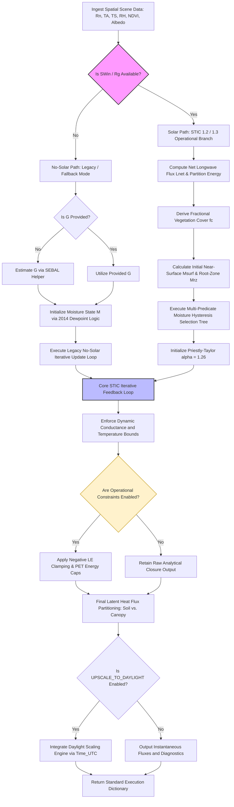
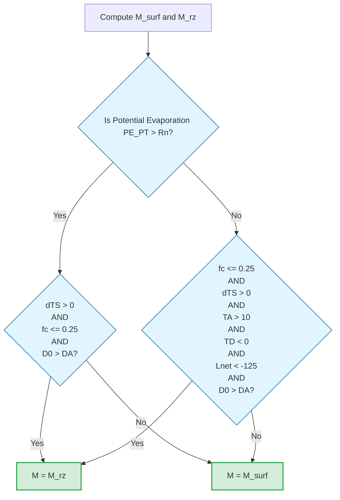

# Unified Algorithm Specification for the Surface Temperature Initiated Closure (STIC) Model
**Comprehensive Scientific and Implementation Manual: From Original Formulation (2014) to ECOSTRESS Collection 3**

---

## 1. Executive Summary & Evolutionary Timeline

The Surface Temperature Initiated Closure (STIC) model is a non-parametric, physically based framework designed to estimate land surface energy fluxes—primarily Latent Heat Flux ($\lambda E$ or $LE$) and Sensible Heat Flux ($H$)—by integrating radiometric Land Surface Temperature ($T_S$ or $T_R$) directly into the Penman-Monteith (PM) formulation. The defining innovation of STIC is its ability to treat aerodynamic conductance ($g_B$ or $g_A$) and surface/canopy conductance ($g_S$ or $g_C$) as internal, state-dependent variables that are solved analytically through simultaneous closure equations, completely bypassing the need for empirical submodels or exogenous wind speed data.

Over more than a decade of research and operational scaling, STIC has evolved from a single-pass diagnostic model into a dynamically constrained, iterative pipeline powering the NASA ECOSTRESS Level-3/4 JPL Evapotranspiration (JET) products. This specification provides a unified, production-grade description of the algorithm’s evolution, underlying thermodynamics, operational branches, and code-level parameters across five critical variants.

### 1.1 Architectural Comparison Matrix

| Algorithmic Dimension | Mallick et al. (2014) | Mallick et al. (2015) | Mallick et al. (2016) | ECOSTRESS Collection 2 (C2) | ECOSTRESS Collection 3 (C3) |
| :--- | :--- | :--- | :--- | :--- | :--- |
| **Model Classification** | STIC 1.0 / 1.1 | STIC 1.2 (Radiometric) | STIC 1.2 (SW-Coupled) | STIC C2 Operational Hybrid | STIC C3 Current Runtime |
| **Execution Architecture** | Single-pass Analytical | Iterative Feedback Loop | Iterative Dual-Source Feedback | Iterative Operational Pipeline | Permissive Operational Runtime |
| **Flux Granularity** | Lumped $\lambda E$ | Lumped $\lambda E$ | Partitioned $\lambda E_E$ & $\lambda E_T$ | Partitioned $LE_{soil}$ & $LE_{canopy}$ | Partitioned $LE_{soil}$ & $LE_{canopy}$ |
| **Conductance Framing** | Bulk $g_B$, Bulk $g_S$ | Bulk $g_B$, Bulk $g_S$ | Canopy $g_A$, Canopy $g_C$ | Bulk $g_B$, Bulk $g_S$ | Bulk $g_B$, Bulk $g_S$ |
| **Priestley-Taylor $\alpha$** | Fixed Constant (1.26) | Dynamically Variable | Dynamically Variable | Variable (Loop Initialized) | Variable (`USE_VARIABLE_ALPHA=True`) |
| **Evaporative Fraction ($\Lambda$)** | Unconstrained AA | Moisture-Constrained AA | Coupled PM-SW Analytical | Moisture-Constrained AA | Moisture-Constrained AA |
| **Hysteresis Logic** | Neglected | Dual-Regime (Granger-Gray) | Eco-physiological ($\Omega$) | Multi-Predicate Decision Tree | Multi-Predicate Decision Tree |
| **Soil Heat Flux ($G$)** | Exogenous Input | Exogenous Input | Exogenous Input | Diurnal Santanello-Friedl | SEBAL Helper (`calculate_SEBAL`) |
| **Max Iterations ($i_{max}$)** | 1 (N/A) | $\sim$ 25 (Flux Stability) | $\sim$ 25 | 3 | 30 |
| **Convergence Threshold** | N/A | Variable Flux Delta | Variable Flux Delta | $\max(LE_{change}) < 1.0 \text{ W m}^{-2}$ | $\max(LE_{change}) < 2.0 \text{ W m}^{-2}$ |
| **Operational Constraints** | None | Physical Bounds | Physical Bounds | Hard Clamping Enforced | Configurable (`False` by default) |

---

## 2. Global Constants, Inputs, and Environmental States

### 2.1 Thermodynamic and Physical Constants
The core computational pipeline across all STIC versions utilizes the following physical parameters:
* $\sigma = 5.670374 \times 10^{-8} \text{ W m}^{-2} \text{ K}^{-4}$ (Stefan-Boltzmann constant)
* $\rho = 1.20 \text{ kg m}^{-3}$ (Standard air density at sea level)
* $c_p = 1013.0 \text{ J kg}^{-1} \text{ K}^{-1}$ (Specific heat capacity of air at constant pressure)
* $\gamma = 0.67 \text{ hPa K}^{-1}$ (Standard psychrometric constant near sea level)
* $\alpha_{PT} = 1.26$ (Base Priestley-Taylor coefficient for potential evaporation initialization)

### 2.2 Primary Spatial and Forcing Inputs
The model ingests a matrix of remote sensing observations and meteorological forcings:
* $R_n$: Net Radiation ($\text{W m}^{-2}$)
* $T_A$: Air Temperature ($^\circ\text{C}$ at reference height)
* $T_S$ / $T_R$: Radiometric Land Surface Temperature ($^\circ\text{C}$)
* $RH$: Relative Humidity (Dimensionless Fraction, $0.0 - 1.0$)
* $\epsilon$: Surface Emissivity (Dimensionless Fraction)
* $\alpha$: Surface Albedo (Dimensionless Fraction)
* $NDVI$: Normalized Difference Vegetation Index (Dimensionless, $-1.0 \text{ to } 1.0$)
* $R_g$ / $SWin$: Incoming Shortwave Radiation ($\text{W m}^{-2}$). *Note: Critical for triggering solar/iterative pathways.*
* $G$: Soil Heat Flux ($\text{W m}^{-2}$) *Note: Injected directly in legacy versions; calculated internally in operational pipelines.*

### 2.3 Foundational Psychrometric Setup Equations
Prior to structural execution, the baseline atmospheric state equations must be established. Saturated vapor pressure at reference height air temperature ($e_{s,A}$), actual atmospheric vapor pressure ($e_a$), vapor pressure deficit ($D_A$), and the slope of the saturation curve ($\Delta$) are derived via standard psychrometric approximations:

$$e_{s,A} = 6.13753 \times \exp\left(\frac{17.27 \times T_A}{T_A + 237.3}\right) \quad \text{}$$

$$e_a = e_{s,A} \times RH \quad \text{}$$

$$D_A = e_{s,A} - e_a \quad \text{}$$

$$\Delta = \frac{4098 \times e_{s,A}}{(T_A + 237.3)^2} \quad \text{}$$

At the land surface interface, utilizing the radiometric surface temperature ($T_S$):

$$e_s^* = 6.13753 \times \exp\left(\frac{17.27 \times T_S}{T_S + 237.3}\right) \quad \text{}$$

$$dT_S = T_S - T_A \quad \text{}$$

The air mass dewpoint temperature ($T_D$) is derived linearly via:

$$T_D = T_A - \left(\frac{100.0 - (RH \times 100.0)}{5.0}\right) \quad \text{}$$

To physically bridge the radiometric surface temperature to the vapor pressure boundaries, the localized slope of the saturation vapor pressure curve is calculated at both dewpoint ($s_1$) and surface ($s_3$) levels using a 3rd-order Taylor-series polynomial approximation:

$$s_1 = \left(45.03 + 3.014 T_D + 0.05345 T_D^2 + 0.00224 T_D^3\right) \times 10^{-2} \quad \text{}$$

$$s_3 = \left(45.03 + 3.014 T_S + 0.05345 T_S^2 + 0.00224 T_S^3\right) \times 10^{-2} \quad \text{}$$

The radiometric surface dewpoint temperature ($T_{SD}$) is subsequently isolated from these psychrometric slopes:

$$T_{SD} = \frac{(e_s^* - e_a) - (s_3 T_S) + (s_1 T_D)}{s_1 - s_3} \quad \text{}$$

---

## 3. Theoretical Foundations & Computational Pathway Selection

The STIC framework operates by restructuring the standard single-source Penman-Monteith energy balance equation:

$$\lambda E = \frac{\Delta \Phi + \rho c_p g_B D_A}{\Delta + \gamma\left(1 + \frac{g_B}{g_S}\right)} \quad \text{}$$

where $\Phi = R_n - G$ represents the net available energy. Because $g_B$ and $g_S$ are unknown, STIC couples this core framework with aerodynamic transfer theories and regional advection-aridity interactions.

### 3.1 Architectural Pathway Selection Matrix
The algorithm determines its logical execution branch based on data availability. In the production ECOSTRESS JET pipeline, this decision architecture dictates whether the model utilizes advanced iterative loops or falls back to legacy/no-solar pathways.



### 3.2 Methodological Divergence: Single-Source vs. Shuttleworth-Wallace Dual-Source
* **Single-Source Big-Leaf (2014 / 2015 / ECOSTRESS Frameworks):** Treats the land surface as an integrated, uniform continuum. The retrieved aerodynamic conductance ($g_B$) represents bulk boundary-layer transport, and surface conductance ($g_S$) captures the parallel, lumped pathways of soil evaporation and canopy transpiration combined.
* **Dual-Source Shuttleworth-Wallace Integration (STIC 1.2 - 2016 Variant):** Explicitly links the PM equations to a nested dual-source configuration. It addresses the in-canopy air stream structure directly, isolating the canopy boundary-layer aerodynamic conductance ($g_A$) from the true canopy-scale stomatal conductance ($g_C$), using $M$ as an explicit index of evaporation efficiency at the soil boundary layer.

---

## 4. Evolution of Moisture Availability ($M$) & Hysteresis Handling

The parameter $M$ defines near-surface moisture availability, bound strictly between $0.0001$ (hyper-arid, zero-evaporation front) and $1.0$ (saturated surface). It establishes the effective surface vapor pressure at the evaporating front:

$$e_S = e_a(1 - M) + M e_S^* \quad \text{}$$

### 4.1 Original Dewpoint Linearization (2014)
The original STIC 1.0 formulation solved for $M$ statically by tracking the psychrometric gradients between the reference air mass and the unobserved surface dewpoint:

$$M = \frac{e_S - e_a}{e_s^* - e_a} \approx \frac{s_1}{s_3} \left[ \frac{T_{SD} - T_D}{k_{TSTD}(T_S - T_D)} \right] \quad \text{}$$

where $k_{TSTD} = \frac{T_0 - T_D}{T_S - T_D}$ acts as a scale factor for aerodynamic temperature ($T_0$).

### 4.2 Granger-Gray and Dual-Regime Hysteresis (2015)
To correct for structural overestimation of $\lambda E$ during afternoon dry-downs, Mallick et al. (2015) introduced feedback loops using Granger and Gray's (1989) model when environmental constraints switch from energy to water limitation. This dual-regime formulation dynamically selects $M$ based on clear-sky diurnal limbs:

$$M_{feedback} = \frac{(e_S - e_a)\gamma}{(e_s^* - e_S)s + (e_{s,A} - e_a)\gamma} = \frac{\gamma s_1 (T_{SD} - T_D)}{s_3 (T_R - T_{SD})s + \gamma s_4(T_A - T_D)} \quad \text{}$$

where $s_4 = \frac{e_{s,A} - e_a}{T_A - T_D}$.

### 4.3 ECOSTRESS Multi-Predicate Operational Decision Logic (C2 / C3)
In the modern JET pipeline, the moisture state is split into surface ($M_{surf}$) and root-zone ($M_{rz}$) parameters, which are then evaluated through a branching logic tree to capture environmental hysteresis.

First, the fractional vegetation cover ($f_c$) is computed and clipped:

$$f_c = \text{clip}\left(\frac{NDVI - 0.04}{0.52 - 0.04}, 0.0, 1.0\right) \quad \text{}$$

The moisture components are defined as:

$$M_{surf} = \left(\frac{s_1}{s_3}\right) \left[ \frac{T_{SD} - T_D}{k_{TSTD}(T_S - T_D)} \right] \quad \text{}$$

$$M_{rz} = \frac{\gamma s_1 (T_{SD} - T_D)}{\Delta s_3 k_{TSTD}(T_S - T_D) + \gamma s_4(T_A - T_D) - \Delta s_1 (T_{SD} - T_D)} \quad \text{}$$

The final operational moisture state ($M$) is selected using the following conditional tree logic:



---

## 5. Analytical STIC Closure Equations

The core of the STIC model relies on simultaneously solving four interconnected state equations ($g_B$, $g_S$, $dT$, and $\Lambda$) to isolate the unobserved aerodynamic and surface conductances.

### 5.1 Formulation of the Evaporative Fraction State Equation ($\Lambda$)
* **Original 2014 Formulation (Unconstrained):** Formulated $\Lambda$ using an open advection-aridity complementarity framework without localized surface wetness boundaries:

$$\Lambda = \frac{2\alpha \Delta}{2\Delta + \gamma\left(2 + \frac{g_B}{g_S}\right)} \quad \text{}$$

* **Iterative 2015 / Operational Formulation (Moisture-Constrained):** Integrates the moisture status ($M$) directly into the denominator of the advection-aridity equation to scale energy partitioning under extreme water-limited states:

$$\Lambda = \frac{2\alpha \Delta}{2\Delta + 2\gamma + \gamma\frac{g_B}{g_S}(1+M)} \quad \text{}$$

### 5.2 Simultaneous Algebraic Solutions for Conductance States
By solving the energy balance matrix alongside the moisture constraints, the model isolates the aerodynamic conductance ($g_B$) and surface conductance ($g_S$) analytically.

#### Aerodynamic Conductance ($g_B$):
$$g_B = \frac{2 \Phi \alpha \Delta \gamma}{2 c_p \Delta e_s \rho - 2 c_p \Delta e_a \rho - 2 c_p e_a \gamma \rho + c_p e_s \gamma \rho + c_p e_s^* \gamma \rho - c_p M e_s \gamma \rho + c_p M e_s^* \gamma \rho} \quad \text{}$$

#### Surface/Stomatal Conductance ($g_S$):
$$g_S = \frac{-2 (\Phi \alpha \Delta e_a \gamma - \Phi \alpha \Delta e_s \gamma)}{c_p (e_s^*)^2 \gamma \rho - c_p e_s^2 \gamma \rho - 2 c_p \Delta e_s^2 \rho + 2 c_p \Delta e_a e_s \rho - 2 c_p \Delta e_a e_s^* \rho + \Psi_{expanded}} \quad \text{}$$

*Note: For the fully expanded algebraic polynomial of the $g_S$ denominator ($\Psi_{expanded}$), engineers should refer directly to the compiled source code.*

#### Aerodynamic Temperature Difference ($dT$):
$$dT = \frac{2\Delta e_s - 2\Delta e_a - 2e_a\gamma + e_s\gamma + e_s^*\gamma - M e_s\gamma + M e_s^*\gamma + 2\alpha\Delta e_a - 2\alpha\Delta e_s}{2\alpha\Delta\gamma} \quad \text{}$$

The internal aerodynamic source-height temperature ($T_0$) is derived via:

$$T_0 = T_A + dT \quad \text{}$$

### 5.3 Physical Boundaries and Operational Clamping
To prevent mathematical singularities and ensure physical realism, the retrieved state variables are passed through strict operational bounding filters at each computational pass:
* $g_B \in [0.0001, 0.20] \text{ m s}^{-1}$ (Aerodynamic Boundary)
* $g_S \in [0.0001, 0.20] \text{ m s}^{-1}$ (Surface/Stomatal Boundary)
* $dT \in [-10.0, 50.0] ^\circ\text{C}$ (Thermal Gradient Boundary)
* $EF \in [0.0, 1.0]$ (Evaporative Fraction Boundary)

---

## 6. The Core Iterative Loop & Convergence Controls

While the 2014 version ran as a single-pass diagnostic engine, all subsequent versions (2015, 2016, and ECOSTRESS) use an iterative feedback loop. This loop dynamically recalculates canopy-source vapor pressures and the Priestley-Taylor $\alpha$ coefficient until a stable latent heat flux state is achieved.

### 6.1 Intrinsic Loop Mathematical Computations
For each discrete iteration step $i = 1 \dots i_{max}$:

1. **Update Canopy-Air Stream Vapor Pressures ($e_0^*$, $D_0$, $e_0$):**
   The saturation vapor pressure ($e_0^*$), vapor pressure deficit ($D_0$), and actual vapor pressure ($e_0$) *at the canopy source/sink height* are re-isolated using the conductances and latent heat flux from the previous pass ($LE_{old}$):

   $$e_0^* = e_a + \frac{\gamma \cdot LE_{old} \cdot (g_B + g_S)}{\rho \cdot c_p \cdot g_B \cdot g_S} \quad \text{}$$

   $$D_0 = D_A + \frac{\Delta \cdot \Phi - (\Delta + \gamma)LE_{old}}{\rho \cdot c_p \cdot g_B} \quad \text{}$$

   $$e_0 = e_0^* - D_0 \quad \text{}$$

2. **Recompute Dynamic Moisture Status ($M$):**
   The moisture selection tree is re-evaluated using the updated $D_0$ and $T_0$ states.

3. **Recalculate Dynamic Priestley-Taylor Coefficient ($\alpha_N$):**
   If variable alpha behavior is enabled, $\alpha_N$ is analytically updated to match the evolving conductance ratio:

   $$\alpha_N = \frac{g_S(e_0^* - e_a) \left[ 2\Delta + 2\gamma + \gamma \left(\frac{g_B}{g_S}\right)(1+M) \right]}{2\Delta \left[ \gamma(T_0 - T_A)(g_B + g_S) + g_S(e_0^* - e_a) \right]} \quad \text{}$$

4. **Execute STIC Closure Core:**
   Re-run the analytical equations for $g_B$, $g_S$, and $dT$ using the updated $\alpha_N$, $e_0$, $e_0^*$, and $M$.

5. **Derive Evolving Latent Heat Flux ($LE_{new}$):**
   Recompute flux values via the closed PM structure:

   $$LE_{new} = \frac{\Delta \Phi + \rho c_p g_B D_A}{\Delta + \gamma\left(1 + \frac{g_B}{g_S}\right)} \quad \text{}$$

6. **Enforce Absolute Energy Caps:**
   Ensure the flux does not violate the conservation of energy:

   $$LE_{new} = \min(LE_{new}, \Phi) \quad \text{}$$

### 6.2 Structural Evolution of Convergence Standards
The stopping criteria for the iterative loop vary significantly between operational versions:

```mermaid
graph TD
    A[Start Iteration i=1] --> B[Compute e0*, D0, e0 Updates]
    B --> C[Update Soil Moisture State M via Iterative Hysteresis Tree]
    C --> D{Is USE_VARIABLE_ALPHA True?}
    D -- Yes --> E[Recalculate Dynamic alpha_N State]
    D -- No --> F[Maintain Current alpha State]
    E & F --> G[Recompute STIC Analytical Closure Matrix for gB, gS, dT]
    G --> H[Calculate New Latent Heat Flux LE_new via PM Form]
    H --> I[Apply Energy Balance Cap: LE_new = min LE_new, Available Energy]
    I --> J[Evaluate Target Convergence Delta: LE_change = |LE_old - LE_new|]
    
    %% Version Branching for Convergence
    J --> K{Select Model Variant Configuration}
    
    K -- Mallick 2015 / 2016 --> L{i >= 25 \n OR \n Flux Stablized?}
    K -- Collection 2 C2 --> M{i >= 3 \n OR \n max LE_change < 1.0 W/m2?}
    K -- Collection 3 C3 --> N{i >= 30 \n OR \n max LE_change < 2.0 W/m2?}
    
    %% Loop Decisions
    L -- No --> O[LE_old = LE_new \n i = i + 1]
    M -- No --> O
    N -- No --> O
    O --> B
    
    %% Exit Loop
    L -- Yes --> P[Freeze Convergence States]
    M -- Yes --> P
    N -- Yes --> P
    P --> Q[Proceed to Final Partitioning Engine]

    style K fill:#fff2cc,stroke:#d6b656,stroke-width:1px
    style L fill:#e1f5fe,stroke:#01579b,stroke-width:1px
    style M fill:#e1f5fe,stroke:#01579b,stroke-width:1px
    style N fill:#e1f5fe,stroke:#01579b,stroke-width:1px
    style P fill:#d4edda,stroke:#28a745,stroke-width:2px
```

---

## 7. Flux Partitioning, Upscaling, and Operational Implementations

### 7.1 Final Latent Heat Component Partitioning Logic
Once the iterative loop achieves convergence, the lumped Latent Heat Flux ($LE$) is partitioned into distinct canopy transpiration ($LE_{canopy}$ or $\lambda E_T$) and soil evaporation ($LE_{soil}$ or $\lambda E_E$) components.

First, a Penman-style Potential Evapotranspiration ($PET$) is calculated:

$$PET = \frac{\Delta \Phi + \rho c_p g_B D_A}{\Delta + \gamma} \quad \text{}$$

Using $M$ as an index for soil evaporation efficiency, the components are isolated and clamped to zero to prevent non-physical negative fluxes:

$$LE_{soil} = \text{clip}(M \times PET, 0.0, \infty) \quad \text{}$$

$$LE_{canopy} = \text{clip}(LE - LE_{soil}, 0.0, \infty) \quad \text{}$$

### 7.2 Soil Heat Flux ($G$) Execution Variations
* **Collection 2 Specification:** Implements a diurnal framework based on Santanello and Friedl (2003), which uses fractional vegetation cover ($f_c$) to interpolate between maximum and minimum soil properties:
  
  $$G = R_n \cdot c_g \cdot \cos\left(2\pi \frac{t_{g0} + 10800}{t_g}\right) \quad \text{}$$

* **Collection 3 Implementation:** Bypasses the Santanello configuration defaults. It hardcodes a direct routing path to `calculate_SEBAL_soil_heat_flux` across both the initialization and active iteration loops, computing soil heat flux based on surface temperature and albedo fields.

### 7.3 Longwave Radiation and Emissivity Handling
The processing of net longwave radiation ($L_{net}$) varies depending on how surface emissivity is applied to incoming atmospheric fluxes ($LWin$). The basic setup defines atmospheric emissivity ($\epsilon_a$), incoming longwave ($LWin$), and outgoing longwave ($LWout$):

$$\epsilon_a = 1.24 \times \left(\frac{e_a}{T_A + 273.15}\right)^{1/7} \quad \text{}$$

$$LWin = \sigma \times \epsilon_a \times (T_A + 273.15)^4 \quad \text{}$$

$$LWout = \sigma \times \epsilon \times (T_S + 273.15)^4 \quad \text{}$$

The model selects between two calculations for $L_{net}$:
1. **Standard Operational Default (Collection 3 Default):** Drops the surface reflectivity correction on incoming atmospheric fluxes:
   
   $$L_{net} = LWin - LWout \quad \text{}$$

2. **Strict Physical Equation Form (Collection 2 Form / Optional C3 Toggle):** Applies the surface emissivity multiplier directly to the incoming longwave term (`apply_surface_emissivity_to_LWin=True`):
   
   $$L_{net} = \epsilon \cdot LWin - LWout \quad \text{}$$

### 7.4 Collection 3 Configuration Toggles & Forcing Fallbacks
Engineers porting Collection 3 code must account for several structural flags and default behaviors:
* **`CONSTRAIN_NEGATIVE_LE` (`Default = False`):** When set to `True`, it clamps negative internal latent heat estimates directly to $0.0 \text{ W m}^{-2}$.
* **`CONSTRAIN_PET` (`Default = False`):** When enabled, it prevents computed actual latent heat from exceeding potential energy limits.
* **`UPSCALE_TO_DAYLIGHT` (`Default = False`):** If activated alongside valid `time_UTC` timestamps, it triggers an integrated diurnal scaling routine to upscale instantaneous snapshots to daylight integrals.
* **Meteorological Fallback Engine:** When running in online mode (`offline_mode=False`), if spatial matrices for air temperature ($T_A$) or relative humidity ($RH$) are missing, the runtime automatically initiates an online data access call to fetch global meteorological grid data from the GEOS-5 FP atmospheric product.

---

## 8. Bibliography

* **Brutsaert, W., and Stricker, H. (1979).** An advection-aridity approach to estimate actual regional evapotranspiration. *Water Resources Research*, 15(2), 443-450.
* **Granger, R. J., and Gray, D. M. (1989).** Evaporation from natural bare soil surfaces. *Journal of Hydrology*, 111(1-4), 21-29.
* **Mallick, K., et al. (2014).** A Surface Temperature Initiated Closure (STIC) for surface energy balance fluxes. *Remote Sensing of Environment*, 141, 243-261.
* **Mallick, K., et al. (2015).** Reintroducing radiometric surface temperature into the Penman-Monteith formulation. *Water Resources Research*, 51(8), 6214-6243.
* **Mallick, K., et al. (2016).** Canopy-scale biophysical controls of transpiration and evaporation in the Amazon Basin. *Hydrology and Earth System Sciences*, 20(10), 4237-4264.
* **Mallick, K., et al. (2018).** Bridging Thermal Infrared Sensing and Physically-Based Evapotranspiration Modeling: From Theoretical Implementation to Validation Across an Aridity Gradient in Australian Ecosystems. *Water Resources Research*, 54(5), 3409-3443.
* **Mallick, K., et al. (2022).** Insights into aerodynamic versus radiometric surface temperature in thermal-based evaporation modeling. *Geophysical Research Letters*, 49(15), e2021GL097568.
* **Monteith, J. L. (1965).** Evaporation and environment. *In 19th Symposia of the Society for Experimental Biology*, 205-234.
* **Penman, H. L. (1948).** Natural evaporation from open water, bare soil and grass. *Proceedings of the Royal Society of London. Series A*, 193(1032), 120-145.
* **Santanello, J. A., and Friedl, M. A. (2003).** Diurnal, seasonal, and fractional vegetation cover controls on land surface heat fluxes. *Journal of Applied Meteorology*, 42(5), 584-594.